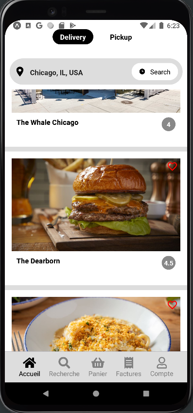

# Uber eats clone 



<p>
  Original tutorial : <a href="https://www.youtube.com/watch?v=jmvbhuJXFow" rel="no-opener no-referrer" target="_blank">https://www.youtube.com/watch?v=jmvbhuJXFow</a>
<p>
  <!-- iOS -->
  <a href="https://itunes.apple.com/app/apple-store/id982107779">
    
  </a>
  <!-- Android -->
  <a href="https://play.google.com/store/apps/details?id=host.exp.exponent&referrer=blankexample">
    
  </a>
  <!-- Web -->
  <a href="https://docs.expo.dev/workflow/web/">
    
  </a>
</p>

## 🚀 How to start

First, get expo, as it will handle the publishing and the dependencies in a "no worries" way.

<a href="https://docs.expo.dev/get-started/installation/" target="_blank" rel="noopener noreferrer">https://docs.expo.dev/get-started/installation/</a>
```
yarn add expo-cli
```

Or globally 
```
yarn global add expo-cli
```
then :

- Install packages with `expo install`. Be sure to update the dependencies with `expo update`.
- Run `expo start` to start the metro bundler.
  - if you need to restart the server without the cache use `expo start -c` instead.
- Read what on the screen to make the app pop
  - will you need to select an Android device to deploy to, you can presse shift+a.

## 📝 Notes

- Learn more about [Universal React](https://docs.expo.dev/).
- See what API and components are [available in the React runtimes](https://docs.expo.dev/versions/latest/).
- Find out more about developing apps and websites: [Guides](https://docs.expo.dev/guides/).
